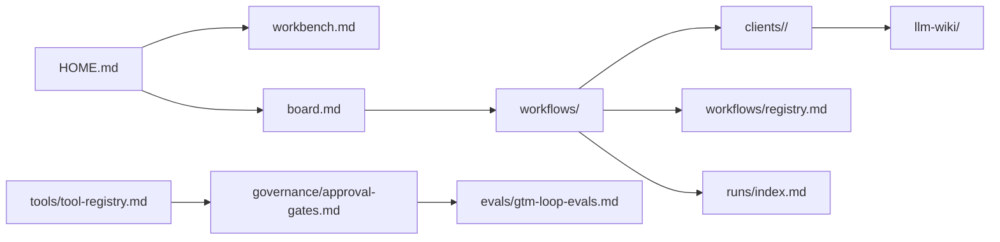

# GTM Loop Home

Daily dashboard for the automation AI workbench.

## Today

| Field | Value |
| --- | --- |
| Active client | `TBD` |
| Active card | `TBD` |
| Stage | Backlog / Investigating / Designing / Building / Validating / Blocked / Done |
| Next action | `TBD` |
| Primary agent | `agents/loop-engineering-workstation-agent.md` |

## Quick Open

| Need | Open |
| --- | --- |
| Workbench state | `workbench.md` |
| Kanban board | `board.md` |
| Agent memory | `llm-wiki/llm-index.md` |
| Current client | `llm-wiki/current-client.md` |
| Tool access | `tools/tool-registry.md` |
| Approval rules | `governance/approval-gates.md` |
| Workflow registry | `workflows/registry.md` |
| Run ledger | `runs/index.md` |
| Evals | `evals/gtm-loop-evals.md` |
| Open WebUI setup | `openwebui-setup.md` |

## Current Work

| Lane | Card | Link | Status |
| --- | --- | --- | --- |
| Backlog | Fill workbench manifest for first real client | `workbench.md` | Open |
| Backlog | Configure Loop Engineering Workstation Agent | `openwebui-setup.md` | Open |
| Blocked | Confirm which client is active | `llm-wiki/current-client.md` | Blocked |

## Workbench Readiness

| Area | Status | Next |
| --- | --- | --- |
| Active client | Unknown | Set in `workbench.md` and `llm-wiki/current-client.md`. |
| Tool registry | Draft | Confirm access levels in `tools/tool-registry.md`. |
| Approval gates | Draft | Review `governance/approval-gates.md`. |
| Payload library | Ready for fake data | Add first fake/redacted payload under `payloads/`. |
| Workflow registry | Ready | Add first automation row. |
| Run ledger | Ready | Log first real run. |

## Tool Status

| Tool | Status | Safe Default |
| --- | --- | --- |
| Open WebUI | Planned | Knowledge-only until setup is complete. |
| Codex | Available | Repo files and validation only. |
| n8n | Unknown | Inspect/draft only after registry is filled. |
| HubSpot | Unknown | No writes without explicit approval. |
| Gong | Unknown | No raw transcript storage. |
| AirOps | Unknown | No publishing without explicit approval. |
| Custom APIs | Unknown | No production mutation without explicit approval. |

## Flow Map

## End Of Session Check

- Board card updated.
- Client owning file updated.
- Run ledger updated for meaningful work.
- Workflow registry updated if automation status changed.
- Evals or validation notes updated when readiness changed.
- No secrets or raw customer data stored.
