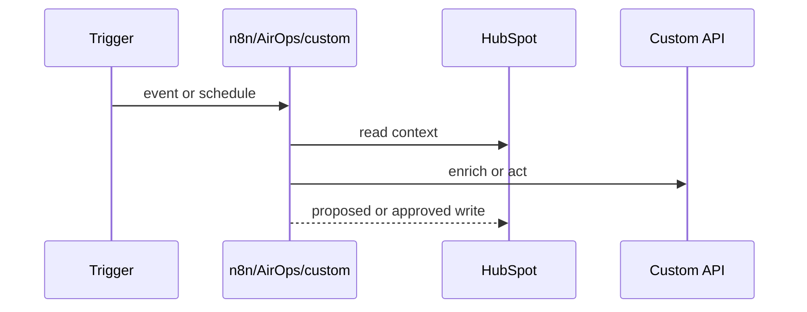

# Integration Flow

## Flow Summary

`TBD`

## Sequence

## Steps

| Step | System | Action | Data | Status | Evidence |
| --- | --- | --- | --- | --- | --- |
| 1 | `TBD` | `TBD` | `TBD` | Unknown | `TBD` |

## Failure Modes

| Failure | Expected Behavior | Owner | Evidence |
| --- | --- | --- | --- |
| `TBD` | Retry / skip / alert / manual review | `TBD` | `TBD` |

## Approval Gates

- `TBD`
