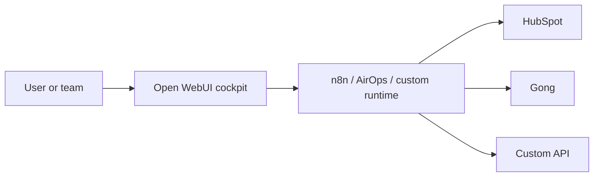

# System Map

## Scope

| Field | Value |
| --- | --- |
| Client / system | `TBD` |
| Purpose | `TBD` |
| In scope | `TBD` |
| Out of scope | `TBD` |
| Evidence | `TBD` |

## Actors And Systems

| Name | Type | Owns | Depends On | Notes |
| --- | --- | --- | --- | --- |
| `TBD` | Person / System / Runtime / Data Store / Vendor | `TBD` | `TBD` | `TBD` |

## C4-Style Context

## Boundaries

- User/customer boundary:
- Auth/identity boundary:
- Internal/external system boundary:
- Data store boundary:
- Vendor boundary:

## Unknowns

- `TBD`
