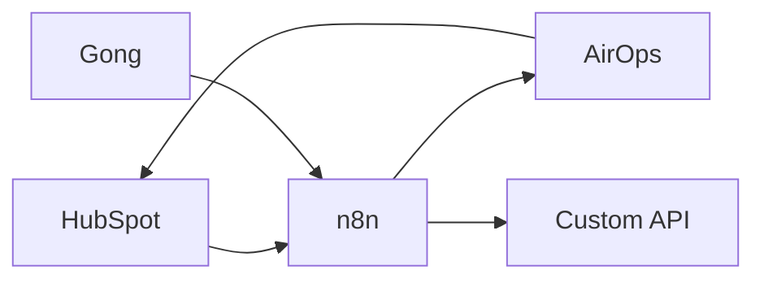

# Systems

## Inventory

| System | Role | Owner | Access | Status | Evidence |
| --- | --- | --- | --- | --- | --- |
| HubSpot | CRM | `TBD` | Read / Write / Unknown | Unknown | `TBD` |
| Gong | Calls and revenue intelligence | `TBD` | Read / Unknown | Unknown | `TBD` |
| AirOps | Prompt/content workflows | `TBD` | Read / Write / Unknown | Unknown | `TBD` |
| n8n | Automation runtime | `TBD` | Read / Write / Unknown | Unknown | `TBD` |
| Custom API | Internal/product integration | `TBD` | Read / Write / Unknown | Unknown | `TBD` |

## System Boundaries

- System of record for accounts:
- System of record for contacts:
- System of record for deals/opportunities:
- System of record for workflow state:
- System allowed to perform writes:

## Integration Sketch

## Unknowns

- `TBD`
