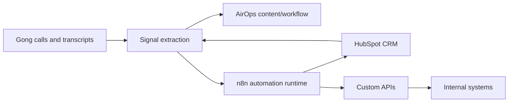

# Systems Map

Cross-client map of systems, ownership, and integration patterns. Keep client-specific details in `clients/<client-slug>/systems.md`.

## Core Systems

| System | Role | Typical Owner | Notes |
| --- | --- | --- | --- |
| HubSpot | CRM records, lifecycle stages, tasks, deals, custom objects | RevOps / Sales Ops | Treat writes as approval-gated. |
| Gong | Calls, transcripts, coaching signals, deal intelligence | Revenue / Enablement | Treat transcripts and participant data as sensitive. |
| AirOps | Content and prompt-chain workflows | Marketing / GTM Ops | Capture workflow purpose, inputs, outputs, and approvals. |
| n8n | Runtime automation, scheduled jobs, webhooks, API orchestration | GTM Engineering / Ops | Track active state, credentials by name only, retries, and failure paths. |
| Custom APIs | Product or internal system access | Engineering / Platform | Capture auth model, endpoints, rate limits, payloads, and owners. |
| Internal repos | Source evidence, workflow definitions, containers | Engineering | Read before assuming behavior. |

## Integration Flow Sketch

## Unknowns To Resolve Per Client

- Which system owns each record type?
- Which system is allowed to write back?
- Which automations are live, paused, test-only, or proposed?
- Which credentials and secrets exist by setting name?
- What audit trail exists for production changes?
